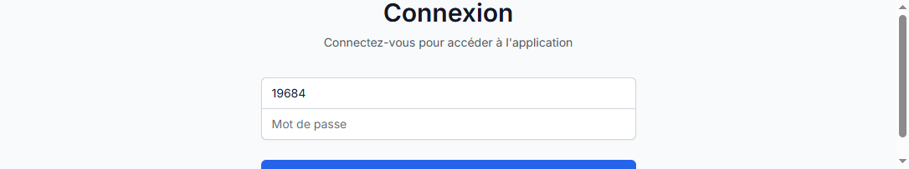
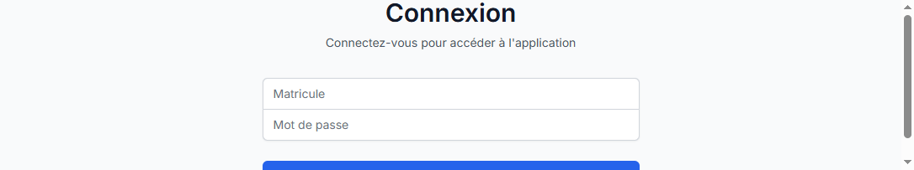
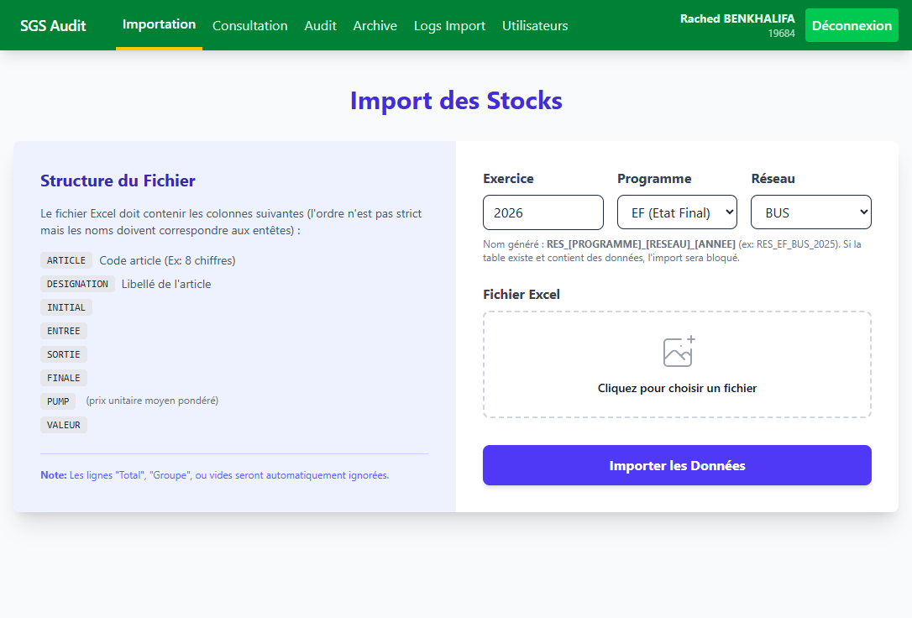
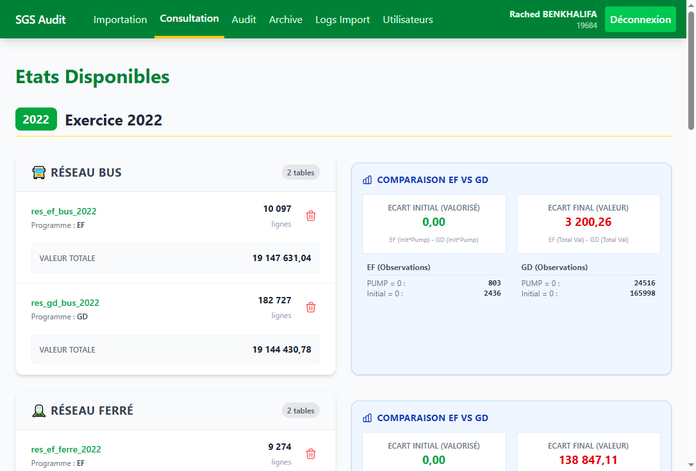
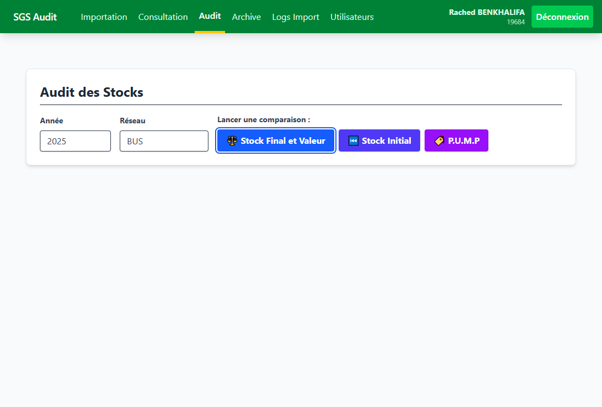
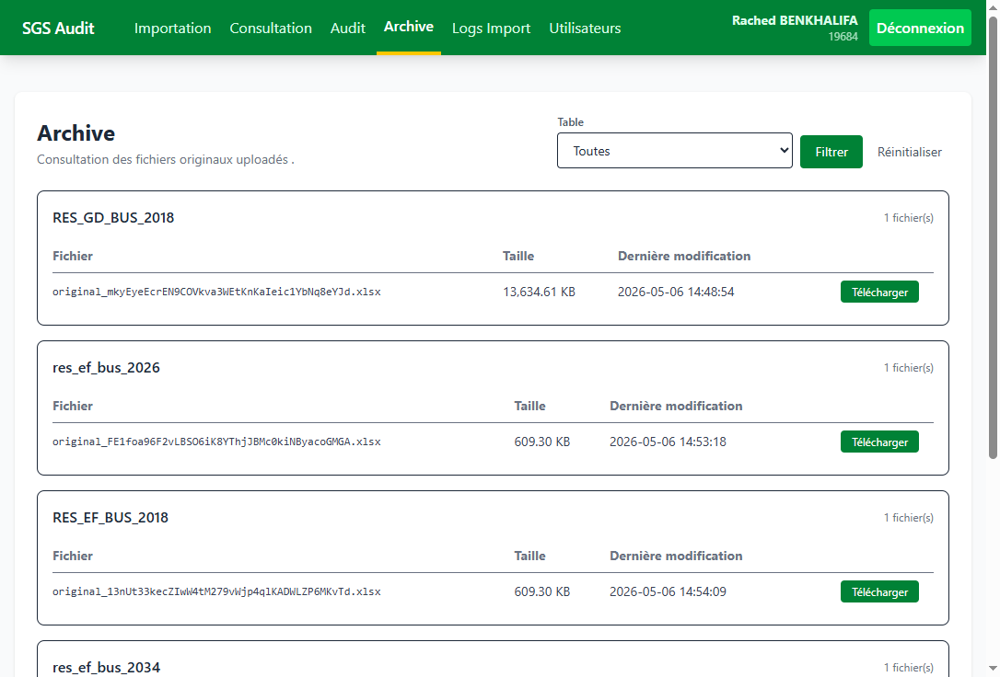
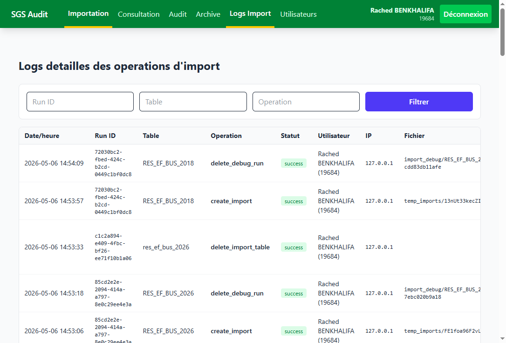
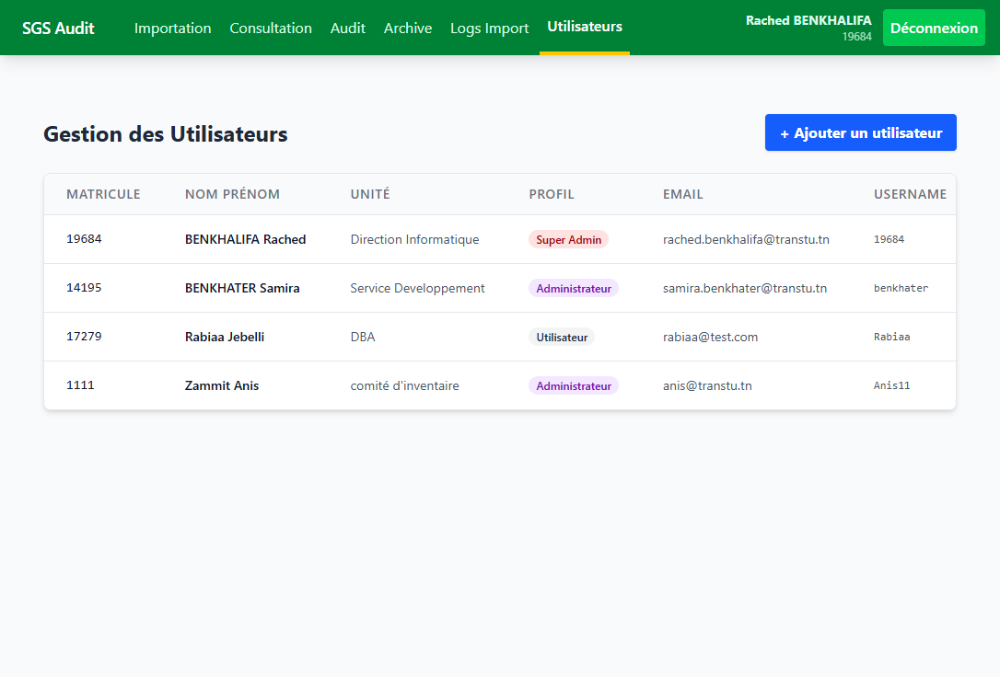

# Guide utilisateur - Audit SGS

Ce guide decrit le parcours utilisateur de base et les comportements attendus de l'application.

## 1) Acces a l'application

URL locale: `http://127.0.0.1:8000/login`

Notes sur la capture:
- Zone 1: champ **Matricule** (identifiant utilisateur).
- Zone 2: champ **Mot de passe**.
- Zone 3: bouton **Se connecter** pour ouvrir une session.
- Si les identifiants sont invalides, rester sur cette page et verifier le message d'erreur.

## 2) Protection des routes metier

Les pages metier sont protegees par authentification. Sans session, la navigation vers `/import`, `/consultation`, `/audit`, `/archive`, `/users` redirige vers `/login`.

Notes sur la capture:
- L'URL demandee est une route metier (`/import`).
- L'application redirige automatiquement vers la page **Connexion**.
- Ce comportement est normal et confirme la protection middleware (`auth`).

## 3) Parcours superadmin valide

Compte de test utilise:
- Login: `19684`
- Mot de passe: `19684`

### 3.1 Ecran Import

Notes sur la capture:
- Zone 1: menu principal complet (Importation, Consultation, Audit, Archive, Logs Import, Utilisateurs).
- Zone 2: formulaire d'import (Exercice, Programme, Reseau, Fichier Excel).
- Zone 3: bouton **Importer les Donnees** pour lancer le traitement.

### 3.2 Ecran Consultation

Notes sur la capture:
- Affiche les exercices et tables disponibles.
- Les blocs **Comparaison EF vs GD** sont visibles par reseau.
- Le bouton suppression de table est present pour profil admin/superadmin.

### 3.3 Ecran Audit

Notes sur la capture:
- Saisie de l'annee et selection du reseau.
- Trois actions disponibles: **Stock Final et Valeur**, **Stock Initial**, **P.U.M.P**.
- Lancer l'audit produit un export/resultat selon l'option choisie.

### 3.4 Ecran Archive

Notes sur la capture:
- Filtre par table disponible en haut de page.
- Liste des fichiers originaux importes avec taille/date.
- Action **Telecharger** disponible pour chaque ligne.

### 3.5 Ecran Logs Import

Notes sur la capture:
- Historique des operations d'import (run id, table, operation, statut, utilisateur, ip, fichier).
- Zone de filtre par `Run ID`, `Table`, `Operation`.
- Ecran reserve au profil superadmin.

### 3.6 Ecran Utilisateurs

Notes sur la capture:
- Liste complete des utilisateurs et profils (Super Admin, Administrateur, Utilisateur).
- Action **+ Ajouter un utilisateur** en haut a droite.
- Actions de maintenance (modifier/supprimer) disponibles sur la liste.

## 4) Checklist de verification rapide

- [x] `/login` repond en `200`.
- [x] `/` redirige vers `/login` si non connecte.
- [x] `/import` redirige vers `/login` si non connecte.
- [x] `/consultation` redirige vers `/login` si non connecte.
- [x] `/audit` redirige vers `/login` si non connecte.
- [x] `/archive` redirige vers `/login` si non connecte.
- [x] `/users` redirige vers `/login` si non connecte.
- [x] `/import/logs` accessible avec compte superadmin.
- [x] `/users` accessible avec compte superadmin.

## 5) Pre-requis techniques (local)

- XAMPP demarre (Apache + MySQL).
- Fichier `.env` configure vers la bonne base locale.
- Lancement serveur Laravel: `php artisan serve --host=127.0.0.1 --port=8000`.
