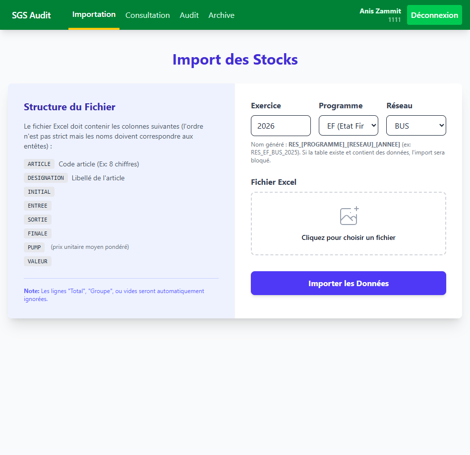
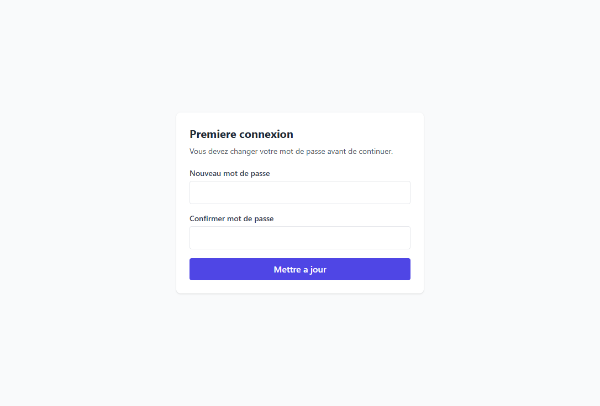
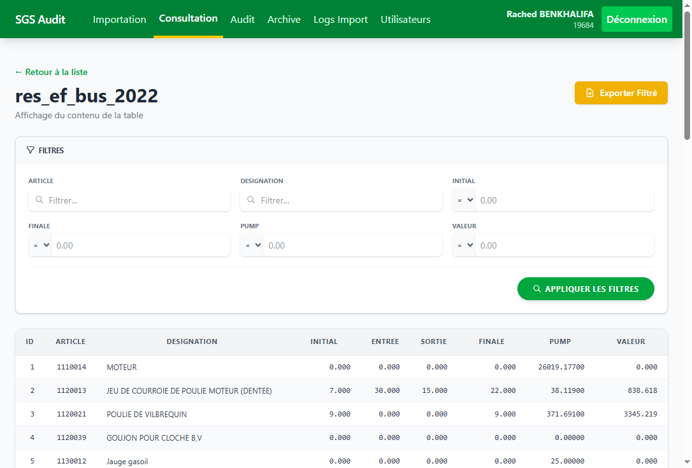
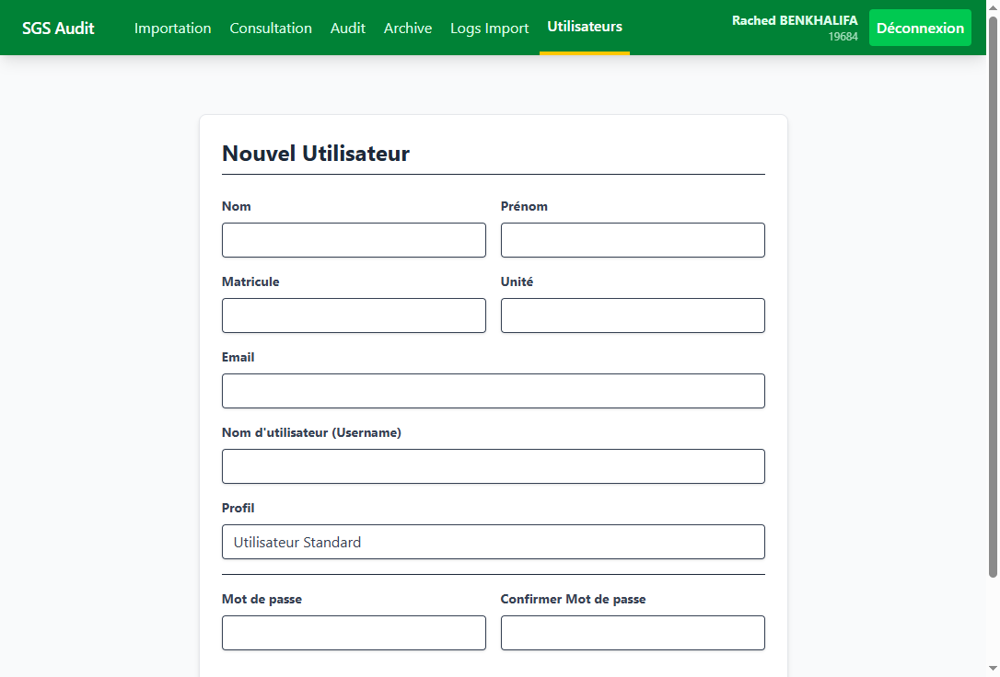
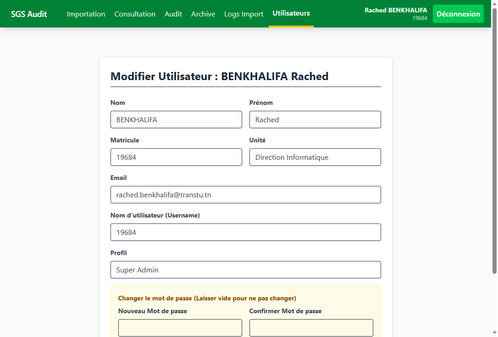
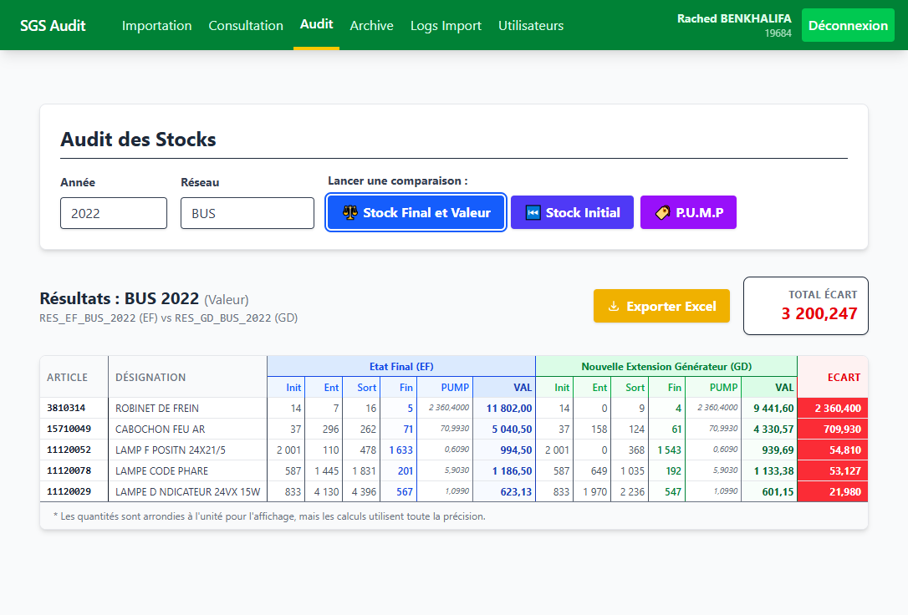

# Guide utilisateur - Audit SGS

Ce guide explique le fonctionnement de l'application Audit SGS pour les profils Administrateur et Superadmin, avec captures d'ecran et exemples reels.

Definitions essentielles (a connaitre avant de commencer):
- **EF** = programme **Etat Final**.
- **GD** = programme **Generateur de donnees**.
- Les comparaisons metier de l'application se font principalement entre les tables `RES_EF_*` et `RES_GD_*`.

Objectif de l'application:
- Importer les donnees de stock par exercice/reseau/programme.
- Consulter les tables chargees.
- Comparer EF et GD pour identifier les ecarts de stock/valeur.
- Archiver et exporter les donnees pour controle et suivi.

## 1) Acces a l'application

URL locale: `http://127.0.0.1:8000/login`

Notes sur la capture:
- Zone 1: champ **Matricule** (identifiant utilisateur).
- Zone 2: champ **Mot de passe**.
- Zone 3: bouton **Se connecter** pour ouvrir une session.
- Si les identifiants sont invalides, rester sur cette page et verifier le message d'erreur.

## 2) Protection des routes metier

Les pages metier sont protegees par authentification. Sans session, la navigation vers `/import`, `/consultation`, `/audit`, `/archive`, `/users` redirige vers `/login`.

Notes sur la capture:
- L'URL demandee est une route metier (`/import`).
- L'application redirige automatiquement vers la page **Connexion**.
- Ce comportement est normal et confirme la protection middleware (`auth`).

## 3) Menus principaux par profil (difference claire)

Cette section compare les menus visibles apres connexion, sans passer par des tests d'acces non autorise.

### 3.1 Profil Superadmin

Compte de test:
- Login: `19684`
- Mot de passe: `19684`

Menu principal visible:
- **Importation** (`/import`)
- **Consultation** (`/consultation`)
- **Audit** (`/audit`)
- **Archive** (`/archive`)
- **Logs Import** (`/import/logs`)
- **Utilisateurs** (`/users`)

### 3.2 Profil Administrateur

Compte de test:
- Login: `1111`
- Mot de passe: `Rached@2024`

Menu principal visible:
- **Importation** (`/import`)
- **Consultation** (`/consultation`)
- **Audit** (`/audit`)
- **Archive** (`/archive`)

Menus non visibles pour administrateur:
- **Logs Import** (`/import/logs`)
- **Utilisateurs** (`/users`)

### 3.3 Capture menu Superadmin

### 3.4 Capture menu Administrateur

## 4) Parcours superadmin valide

### 4.1 Ecran Import (`/import`)

Notes sur la capture:
- Zone 1: menu principal complet (Importation, Consultation, Audit, Archive, Logs Import, Utilisateurs).
- Zone 2: formulaire d'import (Exercice, Programme, Reseau, Fichier Excel).
- Zone 3: bouton **Importer les Donnees** pour lancer le traitement.

### 4.2 Ecran Consultation (`/consultation`)

Notes sur la capture:
- Affiche les exercices et tables disponibles.
- Les blocs **Comparaison EF vs GD** sont visibles par reseau.
- Le bouton suppression de table est present pour profil admin/superadmin.

### 4.3 Ecran Audit (`/audit`)

Notes sur la capture:
- Saisie de l'annee et selection du reseau.
- Trois actions disponibles: **Stock Final et Valeur**, **Stock Initial**, **P.U.M.P**.
- Lancer l'audit produit un export/resultat selon l'option choisie.

### 4.4 Ecran Archive (`/archive`)

Notes sur la capture:
- Filtre par table disponible en haut de page.
- Liste des fichiers originaux importes avec taille/date.
- Action **Telecharger** disponible pour chaque ligne.

### 4.5 Ecran Logs Import (`/import/logs`)

Notes sur la capture:
- Historique des operations d'import (run id, table, operation, statut, utilisateur, ip, fichier).
- Zone de filtre par `Run ID`, `Table`, `Operation`.
- Ecran reserve au profil superadmin.

### 4.6 Ecran Utilisateurs (`/users`)

Notes sur la capture:
- Liste complete des utilisateurs et profils (Super Admin, Administrateur, Utilisateur).
- Action **+ Ajouter un utilisateur** en haut a droite.
- Actions de maintenance (modifier/supprimer) disponibles sur la liste.

## 5) Difference entre Administrateur et Superadmin (idee claire)

Le profil **Administrateur**:
- Peut executer le flux metier quotidien (import, consultation, audit, archive).
- Peut intervenir sur certaines actions d'exploitation (ex: suppression de table selon regles metier).
- Ne peut pas acceder aux ecrans de securite et gouvernance.

Le profil **Superadmin**:
- Dispose de toutes les capacites de l'administrateur.
- Peut acceder a la gestion des utilisateurs (`/users`, creation/modification/suppression).
- Peut consulter les logs detailles d'import (`/import/logs`) pour auditabilite.
- Sert de profil de gouvernance et de controle avance.

## 6) Pages intermediaires (hors menu principal)

Ces pages existent dans le flux metier mais ne sont pas toujours visibles depuis la barre principale.

### 6.1 Changement de mot de passe premiere connexion (`/password/first-login`)

Notes importantes:
- Cette page apparait quand `must_change_password = true`.
- L'utilisateur doit saisir le nouveau mot de passe + confirmation.
- Tant que cette etape n'est pas validee, il ne doit pas poursuivre l'usage metier.

### 6.2 Detail d'une table de consultation (`/consultation/{tableName}`)

URL exemple utilisee: `/consultation/res_ef_bus_2022`

Notes importantes:
- Cette page affiche le contenu complet d'une table importee.
- Filtrage avance par colonne (texte et numerique avec operateurs `=`, `>`, `<`, `>=`, `<=`, `!=`).
- Bouton **Exporter Filtre** pour exporter uniquement le resultat courant.
- Pagination active sur gros volumes.

### 6.3 Formulaire creation utilisateur (`/users/create`)

Notes importantes:
- Ecran d'administration non accessible aux profils standards.
- Le profil choisi (`user`, `admin`, `superadmin`) definit les droits applicatifs.
- Le mot de passe initial est obligatoire, puis l'utilisateur peut etre force au changement au premier login.

### 6.4 Formulaire modification utilisateur (`/users/{id}/edit`)

URL exemple utilisee: `/users/1/edit`

Notes importantes:
- Permet la mise a jour des donnees d'identite et du profil.
- Le bloc "Changer le mot de passe" est optionnel (laisser vide pour conserver).
- Cette page est utile pour le support et la maintenance des comptes.

### 6.5 Resultat de comparaison Audit (`/audit/compare`)

URL exemple utilisee:
`/audit/compare?annee=2022&reseau=BUS&type=valeur`

Alternative validee aussi: annee `2018` avec reseau `BUS`.

Notes importantes:
- Page de resultat detaillee, differente de la page d'entree Audit.
- Affiche l'ecart article par article entre tables EF et GD.
- Bouton **Exporter Excel** pour telecharger le resultat de comparaison.

## 7) Endpoints techniques non visuels (pas de page complete)

- `GET /import/status` : endpoint de polling pour la progression d'import (JSON).
- `GET /consultation/{tableName}/export` : telechargement Excel de la consultation filtree.
- `GET /audit/export` : telechargement Excel des resultats d'audit.
- `GET /archive/{table}/{runId}/{filename}` : telechargement du fichier source archive.
- `POST /import/cache/fix` : correction d'etats de cache import bloques (action technique).
- `POST /logout` : fermeture de session.

## 8) Checklist de verification rapide

- [x] `/login` repond en `200`.
- [x] `/` redirige vers `/login` si non connecte.
- [x] `/import` redirige vers `/login` si non connecte.
- [x] `/consultation` redirige vers `/login` si non connecte.
- [x] `/audit` redirige vers `/login` si non connecte.
- [x] `/archive` redirige vers `/login` si non connecte.
- [x] `/users` redirige vers `/login` si non connecte.
- [x] `/import/logs` accessible avec compte superadmin.
- [x] `/users` accessible avec compte superadmin.
- [x] `/consultation/res_ef_bus_2022` teste et documente.
- [x] `/users/create` teste et documente.
- [x] `/users/1/edit` teste et documente.
- [x] `/password/first-login` teste et documente.
- [x] `/audit/compare?annee=2022&reseau=BUS&type=valeur` teste et documente.
- [x] Connexion administrateur `1111` validee.
- [x] Difference des menus admin/superadmin documentee.

## 9) Pre-requis techniques (local)

- XAMPP demarre (Apache + MySQL).
- Fichier `.env` configure vers la bonne base locale.
- Lancement serveur Laravel: `php artisan serve --host=127.0.0.1 --port=8000`.
